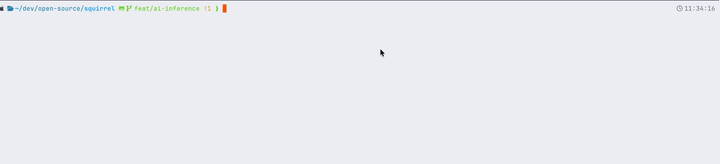

# librime-ai-predict

Rime 插件：使用 **CTranslate2** 做 seq2seq 预测，异步推理并在结果就绪后通过刷新 composition / Context 属性让前端更新候选栏。



与官方 [rime/librime-predict](https://github.com/rime/librime-predict)（Trie 词表预测）不同，本仓库面向 **神经网络 / CT2 导出模型**，因此单独成库，命名为 **`librime-ai-predict`**。

### 语言与简繁（重要）

当前随插件分发的 **`zh-base-ct2-int8` 模型仅针对简体中文训练与优化**。若输入方案或用户词库以繁体为主、或关闭简繁转换，AI 联想质量可能明显下降，甚至出现与上下文不符的字形。

**建议**：在所用拼音方案中**默认开启简体输出**（朙月拼音下为 `simplification` 开关的「汉字」态），与模型一致。示例见 [`examples/schema.fragment.yaml`](examples/schema.fragment.yaml) 中 `default.custom.yaml` / `luna_pinyin.custom.yaml` 片段。

## 端到端体验（推荐）：通过鼠须管 fork

本仓库只是一个 librime 插件，不能单独运行。要实际"输入拼音→看到 AI 候选"，必须配合一个**会处理 `_refresh_ui` / `_comment_highlight` 等保留 property key**（参见 [rime/squirrel#1124](https://github.com/rime/squirrel/issues/1124)）的前端。我们提供了一个鼠须管 fork（`feat/ai-inference` 分支），自带必要的前端增强。

完整端到端流程（含前置依赖、详细解释、常见问题）详见：**[wyjrichhh/squirrel — feat/ai-inference 分支 README](https://github.com/wyjrichhh/squirrel/tree/feat/ai-inference)**

核心命令简版（在空目录 `~/work/` 下从零开始）：

```bash
# 0. 前置：macOS 13+, Xcode 14+, brew install cmake boost
cd ~/work
git clone --recursive -b feat/ai-inference https://github.com/wyjrichhh/squirrel.git
cd squirrel

# 1. 注册插件（squirrel Xcode 工程要求 lua/octagram/predict 也必须在场）
bash librime/install-plugins.sh \
    hchunhui/librime-lua \
    lotem/librime-octagram \
    rime/librime-predict \
    wyjrichhh/librime-ai-predict
( cd librime/plugins/ai-predict && make deps )   # 仅 ai-predict 需要预编 CT2

# 2. 编译并安装鼠须管（含本插件）
export BOOST_ROOT="$(brew --prefix boost)"
make deps && make && sudo make install
# → 注销并重新登录 macOS

# 3. 下载模型（约 300MB）
( cd librime/plugins/ai-predict && ./scripts/download_model.sh )

# 4. 配置 schema 与 modules（详见下文「模块与配置名」）
# 5. 鼠须管菜单 → 重新部署
```

> 上面命令逐行可复现，详细解释、环境变量、常见问题请看 squirrel fork README。

## 进阶：作为通用 librime 插件独立编译

如果你不想用鼠须管 fork，只想把本插件**作为一个 librime 插件库**单独编进自己的 librime（例如要嵌入到其他前端、做 CI 验证、或只关心 librime 侧的输出）：

> 注意：仅独立编译 librime 是**不能直接体验输入法效果**的——你还需要一个能监听保留 property key（`_refresh_ui` 等）的前端。鼠须管原版（不打本 fork 的补丁）也能输入，但 AI 候选不会自动刷新、AI 标识不会被特殊配色。

**前提**：macOS、Xcode CLT、`brew install cmake boost`、可访问 GitHub。

下面假设你在一个空目录 `~/work/` 下从零开始：

1. **拉取 librime 与本插件**

   ```bash
   cd ~/work
   git clone --recursive https://github.com/rime/librime.git
   git clone --recursive https://github.com/wyjrichhh/librime-ai-predict.git \
     librime/plugins/librime-ai-predict
   ```

   librime 的 `plugins/CMakeLists.txt` 会扫描 `plugins/` 下任意含 `CMakeLists.txt` 的子目录，目录名不影响 CMake 识别。

   > 用 squirrel/librime 自带的 `librime/install-plugins.sh wyjrichhh/librime-ai-predict` 也能完成这一步（会把插件装到 `plugins/ai-predict/`，自动剥离 `librime-` 前缀）。
   >
   > 也可以把插件放在 `plugins/` 之外，再用 `export RIME_PLUGINS="librime-ai-predict"` 让 librime 找到它。

2. **预编译插件依赖（CTranslate2 静态库）**

   ```bash
   cd ~/work/librime/plugins/librime-ai-predict
   make deps
   ```

   产物：当前目录下的 `include/`、`lib/libctranslate2.a`（x86_64 还会有 `libcpu_features.a`）。librime 的 CMake 会自动把这里作为 `CTRANSLATE2_ROOT`。

   > 若 CT2 已装在其他前缀，可在 step 3 改用 `cmake . -Bbuild -DCTRANSLATE2_ROOT=/path/to/ct2/prefix ...` 指向它，跳过本步骤。

3. **编译 librime（含本插件）**

   ```bash
   cd ~/work/librime
   make deps   # 若尚未构建 glog / yaml-cpp 等
   make
   ```

   编译日志中应能看到 `librime-ai-predict` 被作为插件加入构建。

4. **下载模型**

   ```bash
   cd ~/work/librime/plugins/librime-ai-predict
   ./scripts/download_model.sh
   ```

   详见下文「获取模型」。

5. **配置 schema 与 modules** —— 与「端到端体验」中的 step 4–5 相同，编辑 `~/Library/Rime/` 下的 `default.custom.yaml` 与目标 schema 的 `*.custom.yaml`，参考 [`examples/schema.fragment.yaml`](examples/schema.fragment.yaml)。

## 获取模型

模型托管在本仓库的 [GitHub Release](https://github.com/wyjrichhh/librime-ai-predict/releases) 中（`zh-base-ct2-int8.tar.gz`，约 300MB）。

### 方式 A：脚本下载（推荐）

```bash
./scripts/download_model.sh
```

默认安装到 `~/Library/Rime/predict_models/zh-base-ct2-int8/`，对应 schema 中的：

```yaml
ai_predict:
  model_path: predict_models/zh-base-ct2-int8
```

如需指向自建镜像：`MODEL_URL=https://your-mirror/.../zh-base-ct2-int8.tar.gz ./scripts/download_model.sh`

### 方式 B：手动放置

把含 `shared_vocabulary.json`、`tokenizer.json`、`model.bin`、`config.json` 的目录放到上述路径下即可，无需运行脚本。

## 模块与配置名（避免与官方 predict 冲突）

| 项目 | 名称 |
|------|------|
| Rime 模块名 | `ai_predict`（请在 `default.yaml` / `default.custom.yaml` 的 `modules` 中加入） |
| Translator 组件名 | `ai_predict_translator`（**必须放在 `engine/translators` 第一位**） |
| Filter 组件名 | `ai_predict_filter`（推荐放在 `engine/filters` 末尾） |
| 方案里配置段 | `ai_predict`（见 `examples/schema.fragment.yaml`） |
| Context 属性（plugin 内部） | `ai_predict/text`：当前 AI 展示文本，由 Translator 写、Filter 读 |
| Context 属性（前端协议） | `_comment_highlight`、`_refresh_ui`（[rime/squirrel#1124](https://github.com/rime/squirrel/issues/1124) 约定的保留 key），由 Filter / PredictionEngine 写、前端读 |

### 常用配置项

| 键 | 说明 | 默认 |
|----|------|------|
| `ai_predict/model_path` | CT2 模型目录；相对路径基于 `user_data_dir` | — |
| `ai_predict/min_input_length` | 无上下文时触发推理的最小拼音字节数。**有上下文（`window_text` 非空）时此阈值不生效，任意非空 prompt 都会触发**；只有冷启动 / 刚按过回车退格 / history 全是标点等场景才用这个阈值兜底 | `12` |
| `ai_predict/context_window_size` | 从 commit history 取多少条作为上下文窗口 | `10` |
| `ai_predict/debounce_ms` | 防抖间隔（毫秒） | `200` |
| `ai_predict/max_tokens` | CT2 单次解码上限 | `256` |
| `ai_predict/device` | `cpu` / `cuda` 等 | `cpu` |
| `ai_predict/target_index` | Filter：AI 候选的 0 基目标位（默认第 2 位） | `1` |
| `ai_predict/search_range` | Filter：在前 N 个上游候选中查找重复 | `10` |
| `ai_predict/quality` | Translator 候选 quality（fallback） | `-1` |

## 架构说明

```
Translator                 Filter                前端 UI
─────────────              ─────────────────     ───────────────
PredictTranslator   ──┐                          comment="AI"
  ├─ Schedule(ctx)   │                           （可配色）
  ├─ cache HIT       │
  │   └─ set_property("ai_predict/text", text)
  │   └─ emit AI cand (slot policy: yield #1, claim #2, dedup #1)
  └─ 兜底候选          ──→  PredictFilter
                            ├─ get_property("ai_predict/text")
                            ├─ 在前 N 个候选中找 text 匹配
                            ├─ 找到 → ShadowCandidate + 移到 slot #2
                            └─ 没找到 → SimpleCandidate 插入 slot #2
```

- `PredictTranslator`：Rime `Translator`，调度推理并写入 `ai_predict/text`（plugin 内部 API）。
- `PredictFilter`：Rime `Filter`，重排候选使 AI 建议落在指定位并去重；同步发布 `_comment_highlight=<idx>` 让前端高亮该索引候选的 comment。
- `PredictionEngine`：后台线程、防抖、缓存；推理完成后 `RefreshNonConfirmedComposition` 并发布 `_refresh_ui="1"` 通知前端刷新。
- `ContextBuilder`：从 `CommitHistory` 构造上下文（跳过 `punct` / `thru` 类型；`ai_predict` 一旦被用户主动选中并提交，与普通汉字 commit 等价，参与上下文）。
- `InferenceBackend` / `CT2Backend`：推理后端抽象与 CTranslate2 实现。

### Translator 与 Filter 的分工

| 责任 | Translator | Filter |
|------|------------|--------|
| 触发异步推理 | 是 | 否 |
| 维护 cache | 是（PredictionEngine） | 否 |
| 广播当前结果 | 是（写 Context 属性） | 否 |
| 精确挪位与去重 | 简易 | 完整 |

两者通过 `ai_predict/text` 解耦。仅配置 Translator 时仍可工作（去重精度较弱）。

## Troubleshooting

| 现象 | 检查 |
|------|------|
| `download_model.sh` 下载失败 / 404 | 网络或代理问题；或 Release 资产名变化。可访问 [Releases 页](https://github.com/wyjrichhh/librime-ai-predict/releases) 手动下载，或用 `MODEL_URL=...` 指向镜像 |
| 插件未加载 / 无 `ai_predict` 组件 | `default.yaml` 或 `default.custom.yaml` 的 `modules` 是否包含 `ai_predict`；部署后是否重载 |
| 报错找不到模型 | `ai_predict/model_path` 相对路径是否相对于 `~/Library/Rime`（`user_data_dir`）；目录下是否有 `shared_vocabulary.json` |
| 无 AI 候选或界面不刷新 | 前端是否实现保留 property key 协议（`_refresh_ui`、`_comment_highlight`）；鼠须管需打 `feat/ai-inference` 分支补丁。详见 [rime/squirrel#1124](https://github.com/rime/squirrel/issues/1124) |
| 日志找不到 | 插件使用独立 glog 实例；宿主可设置 `RIME_LOG_DIR`（如鼠须管 `~/Library/Logs/Squirrel`）。查找 `*.ai_predict.*.log.INFO` |
| `make deps` 子模块失败 | 配置代理后重试；或手动 `git submodule update --init deps/CTranslate2` |
| 编译找不到 nlohmann | 先执行插件目录 `make deps`，确保 `include/nlohmann/json.hpp` 存在 |

## 许可证

见 [LICENSE](LICENSE)（BSD 3-Clause，与 [librime](https://github.com/rime/librime) 一致）。
