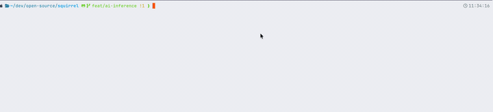

# librime-ai-predict

给鼠鬚管（Rime）接入**本地神经网络联想**的插件：结合上文，把你正在输入的拼音更准确地转成汉字，并把结果补进候选栏。



### 它能做什么

- **结合上文的拼音推理**：模型看的是「上文 + 当前拼音」，把你正在输入的拼音转成最可能的汉字——比如上文是「今天天气」、再输入 `zenmeyang` 时，它结合上下文直接给出「怎么样」，而不是词库按词频挑的默认候选。
- **长词是它的强项**：有充分上下文时，长词的准确率可达 **97%**（详见下方「准确率」）。
- **只做它擅长的事**：单字高频词是输入法自带词库的强项，AI 不跟它抢——单字预测默认交给词库。
- **与官方预测插件互补**：官方 [rime/librime-predict](https://github.com/rime/librime-predict) 按词表预测，本插件面向神经网络模型，独立成库。

### 准确率

从开发者真实输入日志抽取 3531 条「上文 + 拼音 + 实际提交」，看模型首选是否正好等于用户最终打出的字：

| 提交长度 | 首选命中率 |
|---|---|
| 1 个汉字 | 81.4% |
| 2 个汉字 | 92.4% |
| 3 个汉字 | 84.2% |

整体首选命中率约 **87%**，前三个候选覆盖约 **94%**。上文越丰富、要补的词越长，命中率越高——有充分上下文时，长词的准确率可达 **97%**。

### 隐私：输入内容不出本机

所有推理都在**本机完成**（由 CTranslate2 这个本地神经网络推理引擎直接跑在 CPU 上），不联网、不上传任何输入内容。你打的每一个字、每一段上下文，都只存在于自己的设备上；模型文件也是一次性下载到本地，之后完全离线可用。

### 需要一个支持它的前端

本插件本身不能单独运行。要「输入拼音 → 看到 AI 候选」，需要前端配合处理 `_refresh_ui`、`_comment_highlight` 等保留属性键（协议见 [rime/squirrel#1124](https://github.com/rime/squirrel/issues/1124)）。该协议已通过 [rime/squirrel#1143](https://github.com/rime/squirrel/pull/1143) 合并进**上游鼠须管 master**——直接用官方鼠须管即可驱动本插件的异步刷新与 AI 候选配色，不再需要任何 fork。

### 语言与简繁（重要）

当前随插件分发的 **`zh-base-ct2-int8` 模型仅针对简体中文训练与优化**。若输入方案或用户词库以繁体为主、或关闭简繁转换，AI 联想质量可能明显下降，甚至出现与上下文不符的字形。

**建议**：在所用拼音方案中**默认开启简体输出**（朙月拼音下为字形开关的「汉字」态），与模型一致。下面「下载预编译安装包」已默认配好简体；从源码构建则参考 [`examples/schema.fragment.yaml`](examples/schema.fragment.yaml)。

## 快速开始（macOS，推荐）：下载预编译安装包

最省事的方式：直接下载已签名 / 公证的鼠须管安装包，它**内置了 ai-predict 插件、神经网络模型和默认简体配置，装完即用**，无需自己编译或下模型。

1. 到 [Releases 页](https://github.com/wyjrichhh/librime-ai-predict/releases) 下载 `Squirrel-*-ai-predict-arm64.pkg`（**仅 Apple Silicon / arm64**；Intel 或想要通用架构的用户请走下方「从源码构建」）。
2. 双击安装 → **注销并重新登录 macOS** → 在输入法菜单切到「鼠须管」。
3. 输入拼音即可看到 AI 候选（默认落在第 2 位）。

安装包做了什么：先把现有 `~/Library/Rime/` 完整备份到 `~/Library/Rime.backup-<时间戳>/`，然后覆盖 `default.custom.yaml` / `luna_pinyin.custom.yaml`（接入 `ai_predict` 引擎、默认简体朙月拼音），铺设扩展词库与神经网络模型，并自动部署。**会保留**你的 `user.yaml`、`*.userdb`（学习记忆）和其它方案的 `*.custom.yaml`。如需还原，删除新配置、从备份目录拷回即可。

## 从源码构建（进阶 / 非 macOS / Intel / 想要通用架构）

从零编译鼠须管 master（已含 [#1143](https://github.com/rime/squirrel/pull/1143)）连同本插件。在空目录 `~/work/` 下从零开始：

```bash
# 0. 前置：macOS 13+, Xcode 14+, brew install cmake boost
cd ~/work
git clone --recursive https://github.com/rime/squirrel.git
cd squirrel

# 1. 注册插件（squirrel Xcode 工程要求 lua/octagram/predict 也必须在场）
bash librime/install-plugins.sh \
    hchunhui/librime-lua \
    lotem/librime-octagram \
    rime/librime-predict \
    wyjrichhh/librime-ai-predict
( cd librime/plugins/ai-predict && make deps )   # 仅 ai-predict 需要预编 CTranslate2 静态库

# 2. 编译并安装鼠须管（含本插件）
export BOOST_ROOT="$(brew --prefix boost)"
make deps && make && sudo make install
# → 注销并重新登录 macOS

# 3. 下载模型（约 300MB）
( cd librime/plugins/ai-predict && ./scripts/download_model.sh )

# 4. 配置 schema 与 modules（见下文「模块与配置名」与 examples/schema.fragment.yaml）
# 5. 鼠须管菜单 → 重新部署
```

> `install-plugins.sh` 会把插件装到 `plugins/ai-predict/`（自动剥离 `librime-` 前缀）。`make deps` 在插件目录预编 CTranslate2 静态库，产物 `include/`、`lib/libctranslate2.a` 会被 librime 的 CMake 自动当作 `CTRANSLATE2_ROOT`。
>
> Universal binary：`make release ARCHS='arm64 x86_64'`（同时需 `BUILD_UNIVERSAL=1` 让 librime 一并编双架构）。详细解释、环境变量、常见问题见上游 [rime/squirrel](https://github.com/rime/squirrel) 构建文档。

## 获取模型

> 下载预编译安装包的用户可跳过本节——模型已内置。仅从源码构建时需要。

模型托管在本仓库的 [GitHub Release](https://github.com/wyjrichhh/librime-ai-predict/releases) 中（`zh-base-ct2-int8.tar.gz`，约 300MB）。

### 方式 A：脚本下载（推荐）

```bash
./scripts/download_model.sh
```

默认安装到 `~/Library/Rime/predict_models/zh-base-ct2-int8/`，对应 schema 中的：

```yaml
ai_predict:
  model_path: predict_models/zh-base-ct2-int8
```

如需指向自建镜像：`MODEL_URL=https://your-mirror/.../zh-base-ct2-int8.tar.gz ./scripts/download_model.sh`

### 方式 B：手动放置

把含 `shared_vocabulary.json`、`tokenizer.json`、`model.bin`、`config.json` 的目录放到上述路径下即可，无需运行脚本。

## 模块与配置名（避免与官方 predict 冲突）

| 项目 | 名称 |
|------|------|
| Rime 模块名 | `ai_predict`（请在 `default.yaml` / `default.custom.yaml` 的 `modules` 中加入） |
| Translator 组件名 | `ai_predict_translator`（**必须放在 `engine/translators` 第一位**） |
| Filter 组件名 | `ai_predict_filter`（推荐放在 `engine/filters` 末尾） |
| 方案里配置段 | `ai_predict`（见 `examples/schema.fragment.yaml`） |
| Context 属性（plugin 内部） | `ai_predict/text`：当前 AI 展示文本，由 Translator 写、Filter 读 |
| Context 属性（前端协议） | `_comment_highlight`、`_refresh_ui`（[rime/squirrel#1124](https://github.com/rime/squirrel/issues/1124) 约定、由 [#1143](https://github.com/rime/squirrel/pull/1143) 在上游实现的保留 key），由 Filter / PredictionEngine 写、前端读。前端另保留 `_comment_warning`（warning 配色），本插件不发出 |

完整配置项（`min_input_length`、`context_window_size`、`debounce_ms`、`target_index` 等）见 [`examples/schema.fragment.yaml`](examples/schema.fragment.yaml)，那里是单一事实来源。

## 架构说明

```
Translator                 Filter                前端 UI
─────────────              ─────────────────     ───────────────
PredictTranslator   ──┐                          comment="AI"
  ├─ Schedule(ctx)   │                           （可配色）
  ├─ cache HIT       │
  │   └─ set_property("ai_predict/text", text)
  │   └─ emit AI cand (slot policy: yield #1, claim #2, dedup #1)
  └─ 兜底候选          ──→  PredictFilter
                            ├─ get_property("ai_predict/text")
                            ├─ 在前 N 个候选中找 text 匹配
                            ├─ 找到 → ShadowCandidate + 移到 slot #2
                            └─ 没找到 → SimpleCandidate 插入 slot #2
```

- `PredictTranslator`：Rime `Translator`，调度推理并写入 `ai_predict/text`（plugin 内部 API）。
- `PredictFilter`：Rime `Filter`，重排候选使 AI 建议落在指定位并去重；同步发布 `_comment_highlight`（裸索引列表，如 `0` / `0,2`）让前端高亮这些索引候选的 comment。
- `PredictionEngine`：后台线程、防抖、缓存；推理完成后 `RefreshNonConfirmedComposition` 并发布 `_refresh_ui`（query string，如 `source=ai_predict&kind=full`）通知前端刷新候选菜单。
- `ContextBuilder`：从 `CommitHistory` 构造上下文（跳过 `thru` / `raw` 类型；**保留 `punct`**——模型带标点推理更准，标点作为句子结构信号喂入 `window_text`，候选侧由 `StripAllPunctuation` 剥离回显；`ai_predict` 一旦被用户主动选中并提交，与普通汉字 commit 等价，参与上下文）。`raw` 是某段无候选、用户直接提交原始拼音字母时 librime 记的类型，不能当中文上下文回放。`has_context` 以「窗口含汉字」判定，纯标点窗口不绕过冷启动阈值。
- `InferenceBackend` / `CT2Backend`：推理后端抽象与 CTranslate2 实现。

### 前端协议的数据格式

保留 key 的 value 由 `src/frontend_protocol.{h,cc}` 集中生成，编码与上游 `sources/ReservedProperty.swift` 的解析一致：

| Key | 写入方 | 编码 | 示例 |
|-----|--------|------|------|
| `_refresh_ui` | PredictionEngine | URL query string（`source` 必有，`kind` 默认 `full`） | `source=ai_predict&kind=full` |
| `_comment_highlight` | PredictFilter | 裸索引列表（前端归一化到 `value` 字段；空串表示本帧无高亮） | `1` 或 `0,2` |
| `_comment_warning` | （不发出） | 同上，warning 配色 | — |

> 前端在「仅 caret / 选择变化」的更新里**不会清掉**这些保留态评论（`rimeUpdate(clearReservedComments: false)`），只有候选集真正重建时才重算，避免高亮在移动光标时闪烁。

### Translator 与 Filter 的分工

| 责任 | Translator | Filter |
|------|------------|--------|
| 触发异步推理 | 是 | 否 |
| 维护 cache | 是（PredictionEngine） | 否 |
| 广播当前结果 | 是（写 Context 属性） | 否 |
| 精确挪位与去重 | 简易 | 完整 |

两者通过 `ai_predict/text` 解耦。仅配置 Translator 时仍可工作（去重精度较弱）。

## Troubleshooting

| 现象 | 检查 |
|------|------|
| Intel 机装安装包后输入法不工作 | 预编译安装包仅 arm64。Intel 请走「从源码构建」，或自行 `ARCHS='arm64 x86_64' BUILD_UNIVERSAL=1` 打通用架构 |
| `download_model.sh` 下载失败 / 404 | 网络或代理问题；或 Release 资产名变化。可访问 [Releases 页](https://github.com/wyjrichhh/librime-ai-predict/releases) 手动下载，或用 `MODEL_URL=...` 指向镜像 |
| 插件未加载 / 无 `ai_predict` 组件 | `default.yaml` 或 `default.custom.yaml` 的 `modules` 是否包含 `ai_predict`；部署后是否重载 |
| 报错找不到模型 | `ai_predict/model_path` 相对路径是否相对于 `~/Library/Rime`（`user_data_dir`）；目录下是否有 `shared_vocabulary.json` |
| 无 AI 候选或界面不刷新 | 前端是否实现保留属性键协议（`_refresh_ui`、`_comment_highlight`）；官方鼠须管需用含 [#1143](https://github.com/rime/squirrel/pull/1143) 的 master。详见 [rime/squirrel#1124](https://github.com/rime/squirrel/issues/1124) |
| 日志找不到 | 插件使用独立日志实例；宿主可设置 `RIME_LOG_DIR`（如鼠须管 `~/Library/Logs/Squirrel`）。查找 `*.ai_predict.*.log.INFO` |
| `make deps` 子模块失败 | 配置代理后重试；或手动 `git submodule update --init deps/CTranslate2` |
| 编译找不到 nlohmann | 先执行插件目录 `make deps`，确保 `include/nlohmann/json.hpp` 存在 |

## 许可证

见 [LICENSE](LICENSE)（BSD 3-Clause，与 [librime](https://github.com/rime/librime) 一致）。
